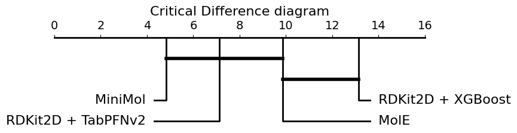

# TabPFN-TDC
TabPFNv2 predicting Absorption, Distribution, Metabolism, Excretion, and Toxicitys (ADMET) of Drugs in the Therapeutic Data Challenge (TDC).  

This work make use of the [TabPFNv2](https://www.nature.com/articles/s41586-024-08328-6) tabular foundation model using the 217 RDKit molecular descriptors as features.

For classification tasks, the fine-tuned version of TabPFNv2 ([📝](https://arxiv.org/abs/2507.03971)) is used, which was trained with real datasets from internet after the synthetic dataset pretraining.

See the [ADMET benchmark](https://tdcommons.ai/benchmark/admet_group/overview/) for more details about the challenge.


## Abstract

Tabular data is one of the most widely used formats in bioinformatics research. Therefore, improving algorithmic baselines for such data has important implications for a wide range of applications. One of these critical applications is the prediction of Absorption, Distribution, Metabolism, Excretion, and Toxicity (ADMET) properties of drugs, a key step in the early stages of drug development. Failures due to poor pharmacokinetic profiles remain a leading cause of attrition in clinical trials, highlighting the need for reliable predictive tools. In recent years, machine learning has emerged as a powerful approach to model complex ADMET behaviors, enabling faster, more cost-effective, and more ethical drug screening pipelines. While some current state-of-the-art approaches, such as MiniMol or MolE, leverage specialized models pretrained on millions of drug-like molecules, Gradient Boosted Decision Trees algorithms like XGBoost continue to serve as strong baselines for many general-purpose tasks.
The objective of this study is to explore the use of novel tabular foundation models as a new baseline for tabular data in bioinformatics, with a focus on ADMET drug prediction. To this end, we used TabPFNv2, an In-Context Learning model based on transformers that was pretrained on synthetic data. For evaluation, we employed the Therapeutic Data Commons benchmark, comprising 22 datasets that include both regression and classification tasks, and extracted the widely used set of 217 RDKit molecular descriptors.
This generic algorithm outperforms XGBoost in 19 out of 22 datasets and surpasses MiniMol in 9 out of 22, despite not relying on any prior, drug-specific knowledge. Notably, TabPFNv2 achieves the top rank in 3 tasks, surpassing specialized methods in the field. These results suggest that TabPFNv2 is a promising baseline for drug prediction, with potential applications in other bioinformatics tasks, including clinical and small omics datasets that meet TabPFNv2’s size constraints. Furthermore, its independence from domain-specific pretraining and hyperparameter tuning enhances its applicability for non-expert practitioners.

### Installation
```bash
conda create --prefix ./env python=3.12
conda activate ./env
pip install -r requirements.txt
```

### Usage
```bash
python tdc_submission.py
```

### Results
Here is the Critical Difference diagram showing the significant differences between using TabPFNv2 and XGBoost with RDKit molecular descriptors:



### Citation
- TabPFNv2 paper: [Accurate predictions on small data with a tabular foundation model](https://www.nature.com/articles/s41586-024-08328-6) 
- TabPFNv2 Finetuned paper: [Real-TabPFN: Improving Tabular Foundation Models via Continued Pre-training With Real-World Data](https://arxiv.org/abs/2507.03971)